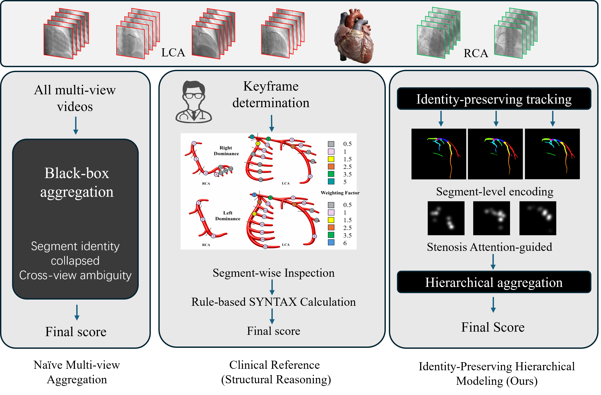
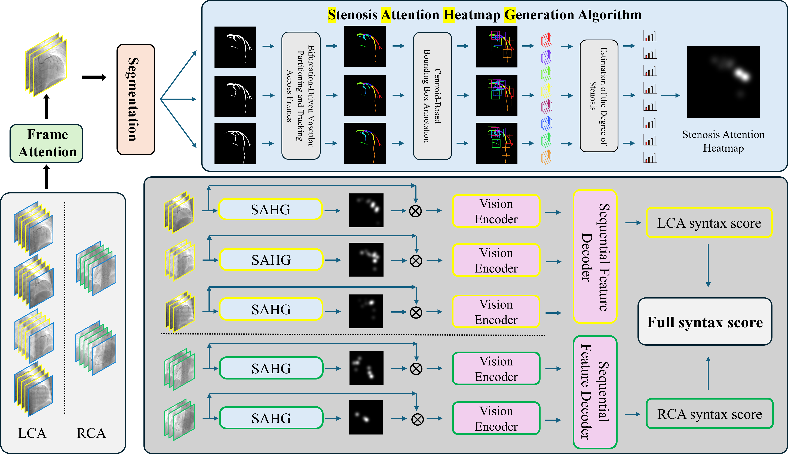

# SYNTAX_PRE

Codebase for **Modeling Clinical Workflow for SYNTAX Scoring from Coronary
Angiography Videos**.





This repository builds on the public CardioSyntax codebase and extends it toward
a clinically aligned SYNTAX scoring workflow. Instead of treating SYNTAX score
prediction as direct black-box regression from multi-view angiography videos, our
work models the task as **vessel segment identity-preserving anatomical
reasoning**: segment-level stenosis evidence is represented as structured
decision fields and then aggregated hierarchically across coronary anatomy and
multi-view videos.

The stable package contains PyTorch/Lightning training and inference code for
left, right, and total SYNTAX score prediction. Experimental branches used while
developing segment-aware heatmap/fusion variants are kept separately from the
stable package.

> This repository is intended for research and reproducibility. It is not a
> medical device and must not be used for clinical decision-making without
> appropriate validation, regulatory review, and local governance approval.

## Features

- CardioSyntax-compatible training and inference pipeline for reproducible
  baseline comparison.
- Segment-aware stenosis heatmap generation from vessel-level stenosis evidence.
- Heatmap/video fusion experiments for structure-aligned SYNTAX prediction.
- Hierarchical left/right coronary aggregation for patient-level prediction.
- Fold-based training and evaluation workflow for left and right coronary
  arteries.
- Utility scripts for metadata splitting, heatmap generation, and debugging.

## Repository Layout

```text
.
├── src/syntax_pre/          # Stable package: datasets, models, training, inference
├── experiments/             # Research variants and in-progress model branches
│   ├── headmapssp/          # Heatmap/headmap fusion experiments
│   ├── htmap/               # Heatmap-fusion sequence experiments
│   └── ssp/                 # Case-level SYNTAX score prediction experiments
├── tools/                   # Data preparation, heatmap generation, debugging helpers
├── examples/                # Local example inputs/outputs; ignored by default
├── pyproject.toml           # Editable install and command-line entry points
└── requirements.txt         # Pinned environment used during development
```

The stable commands below use the `src/syntax_pre` package. Files in
`experiments/` are preserved for research traceability but should be treated as
less validated than the core package.

## Method Overview

This repository releases the code for our workflow-aware SYNTAX scoring work.
The manuscript source, submission files, reviews, rebuttal, and private figures
are not included in the public repository; only the two README figures under
`docs/MICCAI26/LatexSource_5426/figs/` are intended for release. The main
technical ideas are:

- Reformulate automated SYNTAX scoring as vessel segment identity-preserving
  anatomical reasoning.
- Maintain vessel segment identity across frames and views.
- Encode segment-level stenosis evidence with segment-aware decision fields.
- Fuse stenosis attention heatmaps with coronary angiography video features.
- Aggregate evidence hierarchically according to left/right coronary anatomy.

The implementation started from the CardioSyntax benchmark pipeline and adds our
data preparation, heatmap generation, fusion modeling, and workflow-oriented
experiments on top of it.

## Installation

Python 3.10 is recommended.

```bash
git clone https://github.com/VersaceSu7/SYNTAX_score_777.git
cd SYNTAX_score_777
python -m venv .venv
source .venv/bin/activate
python -m pip install --upgrade pip
python -m pip install -e .
```

For exact reproduction of the current local environment, install the pinned
dependency file instead:

```bash
python -m pip install -r requirements.txt
```

CUDA-enabled PyTorch wheels depend on your platform and driver version. If the
default installation does not match your GPU setup, install PyTorch from the
official selector first, then install this project.

## Data

The code expects a dataset root containing DICOM angiography files plus JSON
metadata splits. We use CardioSyntax-compatible metadata for baseline training
and extend the data preparation workflow with vessel segmentation and stenosis
annotations used by our workflow-aware experiments.

The public CardioSYNTAX dataset used by the original benchmark is available at:

- Full dataset: https://zenodo.org/records/14005818
- Sample dataset: https://disk.yandex.com/d/drZKKBJnH2r8vg

Expected metadata structure:

```text
DATASET_DIR/
├── folds/
│   ├── step2_fold00_train.json
│   └── step2_fold00_eval.json
├── rnn_folds/
│   ├── step2_rnn_fold00_train.json
│   ├── step2_rnn_fold00_eval.json
│   └── step2_rnn_fold00_test.json
└── ... DICOM files referenced by metadata path fields
```

Common metadata fields include:

- `study_id`
- `syntax`, `syntax_left`, `syntax_right`
- `videos_left`, `videos_right`
- per-video `path` entries pointing to DICOM files under `DATASET_DIR`

Do not commit patient data, DICOM files, institution identifiers, or derived
metadata that has not been reviewed for public release. The `data/` directory is
treated as a local-only workspace and is ignored by default.

## Weights

CardioSyntax pretrained/sample weights can be downloaded from:

- Sample weights: https://disk.yandex.com/d/_4ARTacETFQr1A

The inference script expects files such as:

```text
LeftBinSyntax_R3D_fold00_mean_post_best.pt
LeftBinSyntax_R3D_fold00_lstm_mean_post_best.pt
LeftBinSyntax_R3D_fold00_bert_mean_post_best.pt
RightBinSyntax_R3D_fold00_mean_post_best.pt
RightBinSyntax_R3D_fold00_lstm_mean_post_best.pt
RightBinSyntax_R3D_fold00_bert_mean_post_best.pt
```

Place weights in a local directory, for example:

```text
ckpt/seq_models_weights/seq_models_weights/
```

The `ckpt/` directory is treated as local-only and is ignored by default. Use
Git LFS or an external model release if you decide to publish trained weights.

## Inference

After installation:

```bash
syntax-pre-apply \
  --dataset-root DATASET_DIR \
  --weights-root WEIGHTS_DIR \
  --fold 0
```

Equivalent module form:

```bash
python -m syntax_pre.seq_apply -r DATASET_DIR -w WEIGHTS_DIR --fold 0
```

The script evaluates the `mean`, `lstm_mean`, and `bert_mean` variants for left
and right arteries, writes prediction-enriched JSON files back under
`DATASET_DIR/rnn_folds/`, and prints classification/regression metrics.

## Training

Create output directories before training:

```bash
mkdir -p backbone seq_models
```

Train the artery-level video backbone:

```bash
syntax-pre-train-backbone -r DATASET_DIR -a left --fold 0
syntax-pre-train-backbone -r DATASET_DIR -a right --fold 0
```

Train the study-level sequence model:

```bash
syntax-pre-train-seq -r DATASET_DIR -a left --fold 0 --variant lstm_mean
syntax-pre-train-seq -r DATASET_DIR -a right --fold 0 --variant lstm_mean
```

Supported sequence variants:

```text
mean_out, mean, lstm_mean, lstm_last, gru_mean, gru_last, bert_mean, bert_cls
```

Default output directories:

- `backbone/` for backbone weights.
- `seq_models/` for sequence model checkpoints.
- `back_logs/` and `seq_logs/` for TensorBoard logs.

These generated directories are ignored by default.

## Tools

Generate a Gaussian heatmap from a stenosis CSV:

```bash
python -m tools.csv_to_heatmap
```

Batch-generate Gaussian heatmaps for nested result folders:

```bash
python -m tools.batch_csv_dir_to_gaussian_heatmap
```

The heatmap tools are used to convert segment-level stenosis evidence into
continuous decision fields for the heatmap/video fusion experiments.

Split `data/all.json` into train/test metadata:

```bash
python -m tools.split_all_json --input data/all.json --train data/all_train.json --test data/all_test.json
```

## Development Notes

- Install the package in editable mode with `python -m pip install -e .`.
- Run stable scripts through the console commands or `python -m syntax_pre...`.
- Run experimental scripts from the repository root, for example
  `python -m experiments.htmap.seq_train_htmp ...`.
- Before opening the repository publicly, inspect `git status --ignored` and
  confirm that no private data, checkpoints, logs, or copyrighted PDFs are staged.
- Keep manuscript source, review/rebuttal files, submission documents, and
  private figures out of the public repository unless they are intentionally
  released.

## Open-Source Checklist

Before publishing:

- Choose and add a real open-source license, for example MIT, Apache-2.0, BSD-3,
  or another license approved by your institution.
- Confirm that the GitHub URLs in `pyproject.toml` point to the final public
  repository.
- Remove or externally host private papers, review notes, local outputs, and
  large model checkpoints.
- Verify all dataset files are de-identified and approved for redistribution.
- Add citation details for any released model weights or derived datasets.
- Replace the placeholder BibTeX for our paper once the final publication
  metadata is available.

## Citation

If you use this repository, please cite our work:

```bibtex
@inproceedings{fu2026syntaxworkflow,
    title     = {Modeling Clinical Workflow for SYNTAX Scoring from Coronary Angiography Videos},
    author    = {Fu, Suzhong and Dong, Jingqi and Ding, Xuan and Sun, Rui and Yang, Yiming and Cui, Shuguang and Li, Zhen},
    booktitle = {MICCAI},
    year      = {2026},
    note      = {Update with final publication metadata}
}
```

This project builds on the CardioSyntax benchmark/codebase. If you use the
CardioSyntax dataset, baseline, or compatible weights, please also cite:

```bibtex
@InProceedings{Ponomarchuk_2025_WACV,
    author    = {Ponomarchuk, Alexander and Kruzhilov, Ivan and Mazanov, Gleb and Utegenov, Ruslan and Shadrin, Artem and Zubkova, Galina and Bessonov, Ivan and Blinov, Pavel},
    title     = {CardioSyntax: End-to-End SYNTAX Score Prediction - Dataset Benchmark and Method},
    booktitle = {Proceedings of the Winter Conference on Applications of Computer Vision (WACV)},
    month     = {February},
    year      = {2025},
    pages     = {5873-5883}
}
```

## License

License is not selected yet. Add a `LICENSE` file before public release.
